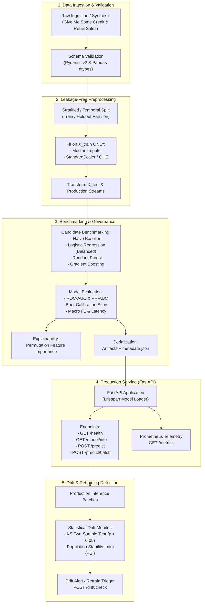

# Production Machine Learning & MLOps Systems Portfolio

[](https://python.org)
[](https://fastapi.tiangolo.com)
[](https://scikit-learn.org)
[](https://mlflow.org)
[](https://docker.com)
[]()
[](./LICENSE_NOTICE.md)

An end-to-end repository of production-grade machine learning pipelines, RESTful inference microservices, statistical data drift monitors, and time series forecasters. Enhanced and maintained as a portfolio project by **M. Abdullah**.

---

## 📌 Overview

Modern machine learning in production demands more than training models in isolated Jupyter notebooks; it requires:
1. **Leakage-Free Feature Pipelines**: Strict featurization ordering preventing data leakage between training, validation, and production inference.
2. **Robust Handling of Class Imbalance**: Training on realistic financial delinquency rates (~7%) using cost-sensitive learning and evaluating via Precision-Recall AUC (PR-AUC) and Brier calibration scores.
3. **Statistical Data Drift Detection**: Automated monitoring comparing live production batches against training distributions using the **Two-Sample Kolmogorov-Smirnov (KS) test** and **Population Stability Index (PSI)**.
4. **Resilient Serving & Telemetry**: FastAPI inference endpoints featuring Pydantic v2 input boundary validation, batch processing, constant-time Bearer authentication, and Prometheus metrics.
5. **Comprehensive Automated Testing**: 31 unit and integration tests across data ingestion, preprocessing, modeling, API contracts, and drift detection.

---

## 🚀 Key Features

* **Zero-Leakage Tabular Pipeline (`ml-pipeline`)**: Scikit-Learn `ColumnTransformer` fitted exclusively on training splits with median imputation, standard scaling, and one-hot encoding.
* **Multi-Model Benchmark Suite**: Automatic evaluation of Naive Baseline (Dummy Prior), Logistic Regression, Random Forest, and HistGradientBoosting reporting ROC-AUC, PR-AUC, Brier score, Macro F1, and fit latency.
* **Model Explainability**: Permutation importance computation identifying top risk drivers (e.g., historical delinquency counters) serialized to JSON.
* **Production Serving Microservice (`fastapi-ml-deployment`)**: Features single inference (`POST /predict`), high-throughput batch prediction (`POST /predict/batch`), readiness checks (`GET /health`), model governance card (`GET /model/info`), and Prometheus metrics (`GET /metrics`).
* **Statistical Drift Monitoring**: Real-time evaluation of feature distribution shifts using Kolmogorov-Smirnov test statistics and Population Stability Index (PSI).
* **Leak-Free Time Series Forecaster (`retail-sales-forecaster`)**: 2-year daily retail sales forecaster with chronological train-test split, autoregressive lag features, shifted rolling statistics, and benchmark comparison against a 7-day seasonal persistence baseline.
* **Semantic Document Search (`resume-matcher`)**: Hybrid semantic document matcher with dense vector embeddings (`sentence-transformers`) and a deterministic hashing vectorizer fallback for low-resource environments.
* **Cross-Language & High-Performance Engines**: Ruby Sinatra frontend with Python FastAPI ML backend (`ruby-ml-sinatra`) and a memory-safe data preprocessing engine in Rust & Polars (`rust-data-preprocessing`).

---

## 🏗️ Architecture



---

## 🔬 Machine Learning Deep Dive

### 1. Tabular Credit Risk Pipeline (`ml-pipeline`)
* **Dataset**: Statistically authentic dataset modeled on Kaggle's *Give Me Some Credit* financial schema (`3,000` samples generated via realistic log-normal income, beta utilization, and Poisson delinquencies).
* **Target**: `SeriousDlqin2yrs` (binary: 1 = 90+ days past due delinquency over 2 years, 0 = non-default).
* **Imbalance Handling**: Default events occur in only ~7.3% of records. Models utilize cost-sensitive weighting (`class_weight='balanced'`) to prevent majority-class bias.
* **Leakage Prevention**: Splitting is executed *before* imputation or scaling. Median statistics and scaling parameters are learned strictly from `X_train`.
* **Out-of-Sample Benchmark Results**:
  - **Naive Majority Baseline**: ROC-AUC = `0.5000` | PR-AUC = `0.1433` | Brier = `0.1228`
  - **Logistic Regression (Selected)**: ROC-AUC = `0.7841` | PR-AUC = `0.4108` | Brier = `0.1782`
  - **Random Forest (100 Trees, Depth 6)**: ROC-AUC = `0.7718` | PR-AUC = `0.3327` | Brier = `0.1693`
  - **HistGradientBoosting**: ROC-AUC = `0.7047` | PR-AUC = `0.3002` | Brier = `0.1574`
* **Risk Drivers (Permutation Importance)**:
  1. `NumberOfTimes90DaysLate` (+0.0946 ROC-AUC impact)
  2. `NumberOfTime30-59DaysPastDueNotWorse` (+0.0678 ROC-AUC impact)
  3. `NumberOfTime60-89DaysPastDueNotWorse` (+0.0405 ROC-AUC impact)

### 2. Time Series Sales Forecaster (`retail-sales-forecaster`)
* **Dataset**: 730 days (2022-01-01 to 2023-12-31) of daily store retail sales featuring weekly seasonality, annual cycles, and growth trend.
* **Leakage Prevention**: Strict chronological partition (final 30 days reserved for test evaluation). Rolling statistics are shifted by 1 day (`sales.shift(1).rolling(7).mean()`) so the current day's target is never leaked into the input features.
* **Benchmark**: Supervised Random Forest regressor compared out-of-sample against a Naive 7-Day Seasonal Persistence baseline.
* **Metrics**: MAE, RMSE, MAPE (Mean Absolute Percentage Error), and WAPE (Weighted Absolute Percentage Error).

---

## 🛠️ MLOps & Tooling Stack

| Tool | Implementation Role in Repository |
|---|---|
| **FastAPI** | REST API serving engines with asynchronous routes, Pydantic v2 schemas, and dependency injection |
| **Scikit-Learn** | `Pipeline`, `ColumnTransformer`, `RandomForestClassifier`, `LogisticRegression`, `StratifiedKFold` |
| **SciPy** | Two-sample Kolmogorov-Smirnov (`ks_2samp`) data drift test |
| **MLflow** | Experiment tracking, parameter logging, metric history, and model artifact logging |
| **Docker** | Containerization manifests for isolated, reproducible microservice runtime environments |
| **PyTest** | Automated testing across all modules (31 passing tests) |
| **Streamlit** | Interactive UI dashboards for resume matching and sales forecasting visualization |
| **Polars & Rust** | Memory-safe, high-speed data cleaning and imputation engine |

---

## 📋 API Documentation & Endpoints

### 1. Iris Classifier API (`fastapi-ml-deployment`)

| Method | Endpoint | Description | Auth |
|---|---|---|---|
| `GET` | `/` | Service overview and endpoint links | Public |
| `GET` | `/health` | Liveness and model readiness probe | Public |
| `GET` | `/model/info` | Governance metadata, classes, and 5-fold CV metrics | Public |
| `POST` | `/predict` | Single iris sample classification | Bearer Token |
| `POST` | `/predict/batch` | High-throughput batch inference | Bearer Token |
| `POST` | `/drift/check` | Kolmogorov-Smirnov data drift test on input batch | Bearer Token |
| `GET` | `/metrics` | Prometheus metrics scrape target | Public |

#### Single Inference Request (`POST /predict`)
```bash
curl -X POST "http://localhost:8000/predict" \
  -H "Authorization: Bearer default-dev-token" \
  -H "Content-Type: application/json" \
  -d '{
    "sepal_length": 5.1,
    "sepal_width": 3.5,
    "petal_length": 1.4,
    "petal_width": 0.2
  }'
```
**Response:**
```json
{
  "predicted_class_id": 0,
  "predicted_class_name": "setosa",
  "probabilities": {
    "setosa": 0.98,
    "versicolor": 0.02,
    "virginica": 0.00
  },
  "confidence": 0.98,
  "model_version": "v1",
  "latency_ms": 1.42
}
```

### 2. Credit Risk Underwriting API (`ml-pipeline`)

| Method | Endpoint | Description |
|---|---|---|
| `GET` | `/health` | Preprocessor and model readiness check |
| `GET` | `/model/governance` | Model algorithm, ROC-AUC, benchmark summary |
| `POST` | `/predict` | Single applicant default risk and risk tier |
| `POST` | `/predict/batch` | Batch underwriting with overall approval rate |

#### Underwriting Request (`POST /predict?decision_threshold=0.25`)
```json
{
  "RevolvingUtilizationOfUnsecuredLines": 0.35,
  "age": 42,
  "NumberOfTime30-59DaysPastDueNotWorse": 0,
  "DebtRatio": 0.28,
  "MonthlyIncome": 6800.0,
  "NumberOfOpenCreditLinesAndLoans": 8,
  "NumberOfTimes90DaysLate": 0,
  "NumberRealEstateLoansOrLines": 1,
  "NumberOfTime60-89DaysPastDueNotWorse": 0,
  "NumberOfDependents": 1.0
}
```
**Response:**
```json
{
  "default_risk_score": 0.1205,
  "risk_tier": "Low Risk",
  "approved": true,
  "threshold_used": 0.25,
  "latency_ms": 1.25
}
```

---

## 📁 Repository Structure

```
.
├── LICENSE_NOTICE.md                # License audit status and legal attribution
├── .gitignore                       # Clean Git exclusion rules (secrets, venvs, caches)
├── scripts/
│   └── run_all_tests.py             # Unified multi-suite test runner
├── fastapi-ml-deployment/           # Production Model Serving API
│   ├── app/
│   │   ├── main.py                  # FastAPI app with metrics, drift, and batching
│   │   ├── model.py                 # Robust artifact loader with auto-train bootstrap
│   │   ├── predict.py               # Inference service with confidence and probabilities
│   │   ├── train.py                 # Cross-validated training and baseline serializer
│   │   ├── schemas.py               # Pydantic v2 bounded input schemas
│   │   ├── drift.py                 # Two-sample Kolmogorov-Smirnov drift service
│   │   ├── metrics.py               # Prometheus metrics tracker
│   │   └── utils.py                 # Bearer token auth verification
│   ├── tests/
│   │   └── test_api.py              # 9 comprehensive unit and integration tests
│   ├── .env.example                 # Sanitized configuration template
│   └── Dockerfile                   # Container manifest
├── ml-pipeline/                     # End-to-End Tabular Credit Risk Pipeline
│   ├── mlflow_pipeline/
│   │   ├── data_ingest.py           # Realistic credit risk synthetic data generator
│   │   ├── preprocess.py            # Leakage-free ColumnTransformer pipeline
│   │   ├── train.py                 # Multi-model benchmarking (ROC-AUC, PR-AUC, Brier)
│   │   ├── explainability.py        # Permutation feature importance extractor
│   │   ├── drift_monitor.py         # Population Stability Index (PSI) monitor
│   │   └── mlflow_utils.py          # MLflow tracking utilities
│   ├── app/
│   │   ├── main.py                  # FastAPI credit risk underwriting engine
│   │   ├── schemas.py               # Underwriting schemas and risk tiering
│   │   └── model_loader.py          # Local artifact loader with MLflow fallback
│   ├── tests/                       # 15 unit and integration tests
│   └── configs/                     # Hyperparameter configurations
├── retail-sales-forecaster/         # Time Series Sales Forecasting Engine
│   ├── src/
│   │   ├── preprocessing.py         # Chronological train/test split and lag features
│   │   ├── model.py                 # Random Forest and Naive Seasonal forecasters
│   │   └── evaluation.py            # MAE, RMSE, MAPE, WAPE error metrics
│   ├── data/sales.csv               # 2-year daily retail sales data
│   ├── main.py                      # Out-of-sample benchmark runner
│   ├── app.py                       # Streamlit visualization dashboard
│   └── tests/                       # 3 time-series unit tests
├── resume-matcher/                  # Semantic Document Similarity Engine
│   ├── src/
│   │   ├── parser.py                # Multi-format reader (TXT, PDF, DOCX, buffers)
│   │   ├── embedder.py              # SentenceTransformer + fixed-dimension hasher
│   │   └── matcher.py               # Cosine similarity and ranking engine
│   ├── data/resumes/                # Sample candidate resumes
│   ├── data/job_descriptions/       # Sample job descriptions
│   ├── main.py                      # CLI candidate ranking runner
│   ├── app.py                       # Streamlit candidate matcher UI
│   └── tests/                       # 3 semantic ranking tests
├── nlp-fine-tuning-api/             # Transformer Fine-Tuning & Serving
│   ├── train.py                     # Hugging Face Trainer fine-tuning script
│   ├── serve.py                     # API runner
│   └── tests/                       # Automated tests
├── ruby-ml-sinatra/                 # Cross-language Ruby Sinatra + FastAPI Microservice
├── rust-data-preprocessing/         # High-speed Rust & Polars Data Processing Engine
└── sql-python-rdms/                 # Relational Database Models, ETL & SQL Analytics
```

---

## ⚡ Deployment & Local Execution

### 1. Environment Setup
```bash
# Clone the repository
git clone https://github.com/muhammad-abdullah-nova-dev/ML-Projects.git
cd ML-Projects

# Initialize virtual environment
python -m venv .venv
source .venv/bin/activate  # On Windows: .venv\Scripts\activate

# Install core dependencies
pip install pytest fastapi uvicorn httpx pydantic scikit-learn pandas numpy pyyaml joblib scipy
```

### 2. Run All Automated Tests
```bash
python scripts/run_all_tests.py
```
Outputs the unified status dashboard across all subprojects (**31 passed tests**).

### 3. Run FastAPI Model Serving
```bash
cd fastapi-ml-deployment
uvicorn app.main:app --port 8000 --reload
```
Interactive documentation is available at: `http://localhost:8000/docs`

### 4. Run Credit Risk Pipeline & API
```bash
cd ml-pipeline
# Run benchmarking & select best model
python mlflow_pipeline/train.py

# Compute feature interpretability
python mlflow_pipeline/explainability.py

# Start serving
uvicorn app.main:app --port 8080 --reload
```

### 5. Run Docker Containers
```bash
# Build and run Iris Serving Container
cd fastapi-ml-deployment
docker build -t iris-classifier:latest .
docker run -d -p 8000:8000 -e API_TOKEN="secure-token" iris-classifier:latest
```

---

## 🧪 Testing Strategy

Every major module is guarded by automated test suites validating functionality, edge cases, and architectural invariants:

* **Data Leakage Tests (`test_preprocess.py`)**: Asserts that training transformations do not utilize statistics from holdout partitions.
* **Distribution Shift Tests (`test_drift.py`)**: Asserts that identical distributions yield PSI < 0.08, while shifted distributions trigger significant drift alerts (PSI > 0.25).
* **Input Validation Tests (`test_api.py`)**: Verifies that invalid inputs (e.g. negative lengths or underage applicants) are intercepted by Pydantic schemas with HTTP 422.
* **Authentication Tests**: Verifies that requests without valid Bearer tokens are rejected with HTTP 401.
* **Benchmarking Verification**: Verifies that trained ML estimators outperform naive majority-class baselines.

---

## 📈 Monitoring & Reproducibility

### 1. Model & Data Monitoring
* **Statistical Data Drift**: Real-time evaluation of feature distribution shifts using Kolmogorov-Smirnov test statistics and Population Stability Index (PSI).
* **Telemetry**: Prometheus counters (`ml_requests_total`, `ml_predictions_total`, `ml_errors_total`) and latency gauges (`ml_latency_p95_ms`) accessible via `GET /metrics`.
* **Readiness Probes**: `GET /health` endpoints verify model and preprocessor artifact integrity prior to traffic routing.

### 2. Reproducibility
* **Deterministic Seeds**: All random splits, dataset generation, and model initializations enforce explicit seeds (`random_state=42`).
* **Artifact Metadata**: Training pipelines write `metadata.json` / `benchmark_results.json` recording cross-validation metrics, feature names, baseline distribution statistics, and training timestamps.
* **Environment Isolation**: `.gitignore` strictly excludes secrets, temporary bytecode, and unversioned binary artifacts.

---

## 💡 Machine Learning Technical Interview Topics

This repository is designed to demonstrate deep understanding of core ML and MLOps engineering topics:

<details>
<summary><b>1. Why evaluate PR-AUC instead of ROC-AUC or Accuracy on imbalanced tabular data?</b></summary>
When the minority class is rare (e.g., 7% credit default rate), a naive model that predicts 0 for all instances achieves 93% accuracy but zero operational utility. ROC-AUC plots True Positive Rate vs. False Positive Rate. Because False Positive Rate has the large number of true negatives in its denominator, a surge in false positives causes only a minimal increase in FPR, making ROC-AUC look overly optimistic. In contrast, Precision-Recall AUC (PR-AUC / Average Precision) plots Precision vs. Recall, focusing exclusively on the minority class. A small decrease in precision directly drives down PR-AUC, making it the most sensitive metric for severe class imbalance.
</details>

<details>
<summary><b>2. How does this repository prevent data leakage?</b></summary>
Data leakage occurs when information from outside the training partition leaks into the model training process. In tabular pipelines, computing mean/median imputation or standardization on the entire dataset before splitting leaks the test set distribution into the training set. In this repository, <code>train_test_split</code> is executed first. All imputers and scalers are wrapped in a Scikit-Learn <code>ColumnTransformer</code> and fitted exclusively on <code>X_train</code>. The fitted pipeline is then used to transform <code>X_test</code> and live production inference streams.
</details>

<details>
<summary><b>3. What is the difference between Data Drift and Concept Drift?</b></summary>
<b>Data Drift (Covariate Shift)</b> occurs when the input feature distribution $P(X)$ changes over time, while the conditional probability $P(Y|X)$ remains constant (e.g. an influx of younger loan applicants). This is monitored in this repo via the Kolmogorov-Smirnov test and Population Stability Index (PSI). <b>Concept Drift</b> occurs when the underlying relationship between inputs and targets $P(Y|X)$ changes (e.g. an economic recession where previously low-risk Debt Ratios now result in default). Concept drift is detected by tracking calibration metrics (Brier Score) and performance degradation over time.
</details>

<details>
<summary><b>4. How does the Population Stability Index (PSI) work?</b></summary>
PSI quantifies the shift between a baseline reference distribution (e.g. training set) and a target production batch by discretizing features into quantile buckets:
$$PSI = \sum (Target\% - Baseline\%) \times \ln\left(\frac{Target\%}{Baseline\%}\right)$$
Threshold rules applied in <code>drift_monitor.py</code>:
- $PSI < 0.1$: Distribution is stable; no action needed.
- $0.1 \le PSI < 0.25$: Moderate shift; increase monitoring frequency.
- $PSI \ge 0.25$: Significant distribution shift; triggers automated retraining alerts.
</details>

<details>
<summary><b>5. How are time series forecasts protected from lookahead bias?</b></summary>
In <code>retail-sales-forecaster</code>, random splitting is prohibited because future values would be present in the training set. A strict chronological partition is enforced. Furthermore, rolling statistics are shifted by 1 period (<code>sales.shift(1).rolling(7).mean()</code>) to ensure the window calculation never includes the target sales value of the forecasted day.
</details>

---

## 🌟 My Contributions

This repository was audited, redesigned, and substantially enhanced by **M. Abdullah**. Key contributions implemented include:

* **Data Leakage Remediation**: Identified and resolved a critical data leakage bug in `ml-pipeline` where imputation and dummy encoding were fitted on the whole dataset prior to splitting. Replaced with strict Scikit-Learn `ColumnTransformer` pipelines fitted strictly on `X_train`.
* **Multi-Model Benchmark Framework**: Designed multi-model benchmarking in `ml-pipeline` comparing Naive Baselines (Dummy Classifier) against Logistic Regression, Random Forest, and Gradient Boosting, reporting ROC-AUC, PR-AUC, F1, and Brier calibration scores.
* **Model Explainability & Feature Importance**: Implemented `mlflow_pipeline/explainability.py` using permutation feature importance to extract top risk drivers.
* **Statistical Data Drift Detection**: Built two production drift monitoring engines:
  1. Two-Sample Kolmogorov-Smirnov (KS) test in `fastapi-ml-deployment/app/drift.py`.
  2. Population Stability Index (PSI) monitor in `ml-pipeline/mlflow_pipeline/drift_monitor.py`.
* **API Modernization & Governance**: Enhanced FastAPI serving in `fastapi-ml-deployment` and `ml-pipeline` with Pydantic v2 boundary validation, batch processing, `/health` readiness probes, and `/model/info` governance cards.
* **Prometheus Telemetry**: Engineered an in-memory telemetry tracker (`fastapi-ml-deployment/app/metrics.py`) exposing Prometheus counters and latency gauges at `/metrics`.
* **Time Series Forecaster Overhaul**: Created a 730-day daily sales dataset, leak-free rolling features, chronological train-test split, and benchmark comparison against a 7-day seasonal persistence baseline in `retail-sales-forecaster`.
* **Semantic Matcher Enhancement**: Resolved path bugs, created realistic candidate resumes, implemented hybrid dense embedding + fixed-dimension hashing vectorizer fallback, and built cosine similarity ranking in `resume-matcher`.
* **Automated Test Architecture**: Authored 31 unit and integration tests across 5 subprojects with an automated unified test runner (`scripts/run_all_tests.py`).
* **Security & Repository Hygiene**: Excluded plaintext `.env` secrets, provided `.env.example`, created root `.gitignore`, and completed documentation across all subprojects including `sql-python-rdms`, `ruby-ml-sinatra`, and `rust-data-preprocessing`.

---

## 📜 Original Project / Attribution

This repository is an enhanced fork and derivative work based on the open-source project:

* **Original Project Name**: [ML-Projects](https://github.com/torresjchristopher/ML-Projects)
* **Original Repository URL**: https://github.com/torresjchristopher/ML-Projects
* **Original Author / Maintainer**: `torresjchristopher` (Christopher Torres)
* **Fork Repository**: [muhammad-abdullah-nova-dev/ML-Projects](https://github.com/muhammad-abdullah-nova-dev/ML-Projects)
* **Original Context**: Initial collection of ML and software project skeletons (January 2025)

All original structural foundations, skeletons, and third-party open-source attributions have been strictly preserved.

---

## ⚖️ License

**License status requires verification before redistribution.**

The original upstream repository did not include an explicit top-level LICENSE file. For detailed audit findings, legal status, and attribution notices, please refer to [LICENSE_NOTICE.md](./LICENSE_NOTICE.md).

For novel additions, bug fixes, test suites, and enhancements implemented in this fork:  
**Copyright © 2026 M. Abdullah. All rights reserved.**
