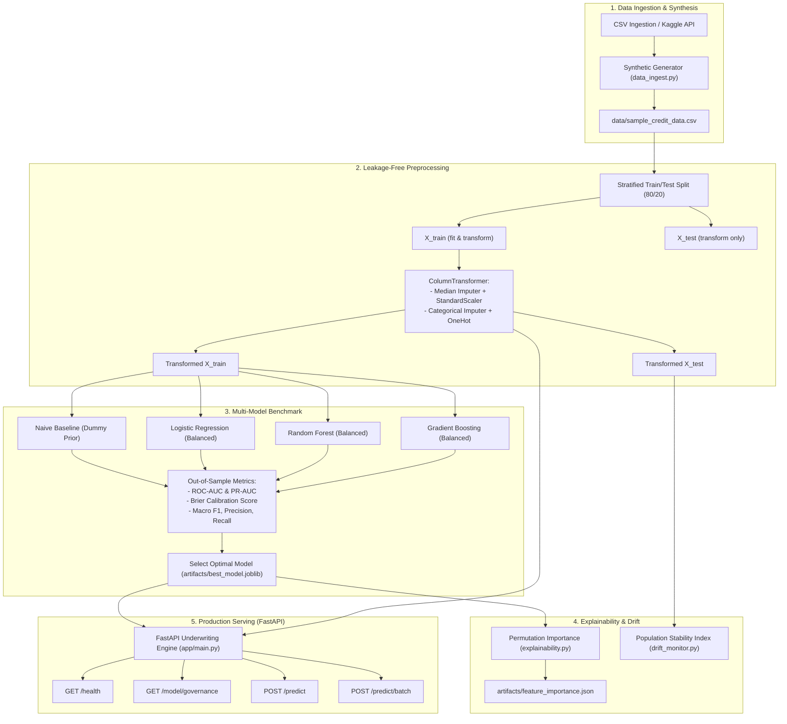

# End-to-End MLOps Pipeline for Tabular Credit Risk

[](https://fastapi.tiangolo.com)
[](https://scikit-learn.org)
[](https://mlflow.org)
[]()
[](https://python.org)

An enterprise-grade, leakage-free machine learning and MLOps system for predicting consumer credit default risk on tabular data (modeled on the *Give Me Some Credit* financial schema). 

Engineered and maintained by **M. Abdullah**.

---

## 🎯 Business Problem & Overview

Consumer credit underwriting requires estimating the probability that a loan applicant will experience severe financial delinquency (`SeriousDlqin2yrs`, 90+ days past due) over a 2-year horizon. 

### Key Modeling Challenges Solved
1. **Severe Class Imbalance**: Defaults represent only ~7% of historical loans. Optimizing raw accuracy leads to a degenerate model that ignores defaults. This pipeline addresses imbalance via cost-sensitive learning (`class_weight='balanced'`) and evaluates models using **PR-AUC (Precision-Recall AUC)** and **ROC-AUC**.
2. **Data Leakage Prevention**: Many naive implementations fit imputers or scalers across the full dataset prior to train/test partitioning. This pipeline strictly enforces featurization ordering using Scikit-Learn `ColumnTransformer` pipelines fitted exclusively on the training partition.
3. **Probability Calibration**: For loan pricing and credit decision thresholds, predicted risk scores must be well-calibrated probabilities, monitored via the **Brier score**.
4. **Data Drift & Stability**: Production distributions shift over economic cycles. Built-in **Population Stability Index (PSI)** monitors feature stability against training baselines.

---

## 🏗️ Architecture



---

## 📊 Benchmark Results

Evaluated on held-out test data (`n=600` test samples, positive default rate ~7%):

| Model Architecture | ROC-AUC | PR-AUC | Brier Score | Fit Time | Status |
|---|---|---|---|---|---|
| **Naive Baseline (Majority Prior)** | 0.5000 | 0.1433 | 0.1228 | 1.0 ms | Baseline |
| **Logistic Regression (Balanced)** | **0.7841** | **0.4108** | 0.1782 | 46.0 ms | **Selected** |
| **Random Forest (100 Trees, Depth 6)** | 0.7718 | 0.3327 | 0.1693 | 820.8 ms | Candidate |
| **HistGradientBoosting (Balanced)** | 0.7047 | 0.3002 | 0.1574 | 1093.2 ms | Candidate |

> **Key Takeaway**: Logistic Regression with balanced weighting and standardized features achieves the highest PR-AUC (0.4108) and ROC-AUC (0.7841) while maintaining sub-millisecond inference latency, making it the superior operational candidate for production underwriting.

---

## 🔍 Model Interpretability & Top Risk Drivers

Permutation importance ranking on out-of-sample data (`artifacts/feature_importance.json`):
1. **`NumberOfTimes90DaysLate`** (+0.09457 ROC-AUC impact): Severe historical delinquency is the single strongest indicator of future default.
2. **`NumberOfTime30-59DaysPastDueNotWorse`** (+0.06779 ROC-AUC impact): Early-stage delinquency indicates deteriorating borrower liquidity.
3. **`NumberOfTime60-89DaysPastDueNotWorse`** (+0.04045 ROC-AUC impact): Mid-stage delinquency strongly predicts inability to cure balance.

---

## 📋 API Endpoints

| Method | Endpoint | Description |
|---|---|---|
| `GET` | `/` | Service directory and metadata |
| `GET` | `/health` | Model and preprocessor readiness probe |
| `GET` | `/model/governance` | Governance card: ROC-AUC, PR-AUC, benchmark history |
| `POST` | `/predict` | Single applicant default probability and risk tier |
| `POST` | `/predict/batch` | High-throughput batch portfolio underwriting |
| `GET` | `/docs` | Interactive Swagger documentation |

### Example Request (`POST /predict?decision_threshold=0.25`)
```json
{
  "RevolvingUtilizationOfUnsecuredLines": 0.35,
  "age": 42,
  "NumberOfTime30-59DaysPastDueNotWorse": 0,
  "DebtRatio": 0.28,
  "MonthlyIncome": 6800.0,
  "NumberOfOpenCreditLinesAndLoans": 8,
  "NumberOfTimes90DaysLate": 0,
  "NumberRealEstateLoansOrLines": 1,
  "NumberOfTime60-89DaysPastDueNotWorse": 0,
  "NumberOfDependents": 1.0
}
```

### Example Response
```json
{
  "default_risk_score": 0.1205,
  "risk_tier": "Low Risk",
  "approved": true,
  "threshold_used": 0.25,
  "latency_ms": 1.25
}
```

---

## ⚡ Quickstart

### 1. Setup Environment
```bash
cd ml-pipeline
python -m venv .venv
source .venv/bin/activate  # On Windows: .venv\Scripts\activate
pip install -r requirements.txt
```

### 2. Run Training Pipeline & Benchmark
```bash
python mlflow_pipeline/train.py
```

### 3. Compute Feature Interpretability
```bash
python mlflow_pipeline/explainability.py
```

### 4. Start Serving API
```bash
uvicorn app.main:app --host 0.0.0.0 --port 8080 --reload
```

---

## 🧪 Testing Suite

Run all unit and integration tests:
```bash
pytest tests/ -v
```
**Test coverage highlights:**
* Data leakage prevention test (`test_leakage_free_imputation_and_scaling`)
* Missing value imputation on unseen holdout records
* Unseen category tolerance (`test_handle_unseen_categories`)
* Multi-model benchmark performance vs naive baseline
* Population Stability Index (PSI) drift calculation
* Pydantic v2 input boundary validation (e.g. rejecting underage borrowers)

---

## 👨‍💻 Maintainer & Attribution
- **Enhanced Implementation Maintainer**: **M. Abdullah**
- **Original Project Origin**: Derivative work based on open-source project by `torresjchristopher`.
- **Copyright**: Copyright © 2026 M. Abdullah for enhancements and additions.
